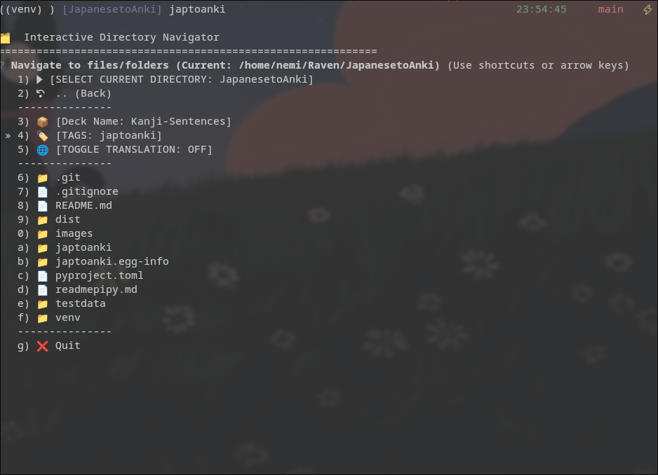
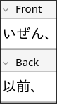
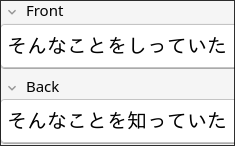

# Japtoanki ⚡📖
**Automated pipeline to turn Japanese text from files or images into high-quality anki-flashcards**
Extracts sentences containing kanji from manga, screenshots, etc, with mokuro and automatically creates Anki flashcards for later study.
Uses Mokuro OCR to find text from images, and MeCab (Fugashi) to filter bad grammar and readings.

---

#### Features:

- Morphological analysis (MeCab / Fugashi) to discard OCR halucinations and junk,
- Generates standard *furigana* reading,
- Users can provide a .txt, .json, .md file containing kanji they have already mastered to cease support (links, furigana) for those kanji,
- Automatically links every unmastered kanji to the Hochanh RTK Guide,
- Pushes cards directly to Anki when Anki-connect is enabled, otherwise generates .csv decks to manually import into anki,
- Easy file navigation.

## Installation

```bash
pip install japtoanki
```

#### Requirements:

- [Python3.12](https://www.python.org/downloads/release/python-31212/)
- [Anki](https://apps.ankiweb.net/)
- [Mokuro OCR](https://github.com/kha-white/mokuro) (installed as depency)

## Usage

**Command Line Interface**

Running *japtoanki* opens a file navigator.

```bash
japtoanki
```

Highly recommended to use with [Anki-connect](https://github.com/amikey/anki-connect) plugin in Anki. Anki needs to be open as japtoanki runs.

```bash
japtoanki /path/to/directory --deck Kanji_Sentences --tag manga --translate en --mastered-kanji /path/to/file
```

---

### Note Model

Japtoanki creates a custom model in Anki with the following fields:

    Front: Reading only (Hiragana/Katakana).

    Back: The original sentence (Kanji).

    Furigana: Standard Anki furigana format.

    HochanhLinks: One-click links to Kanji study resources.

    Translation: Automatic translation via Google Translator.

## Examples

#### Cli file navigation




#### Anki card
 
