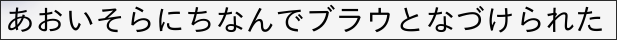
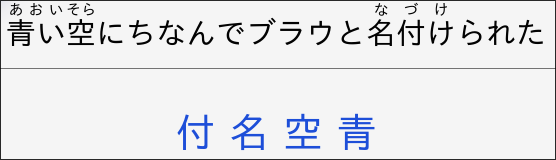
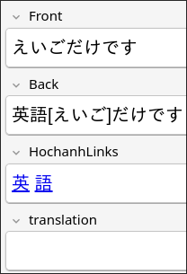
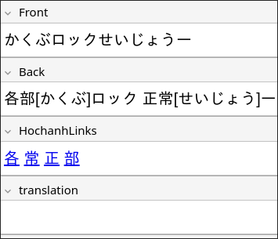
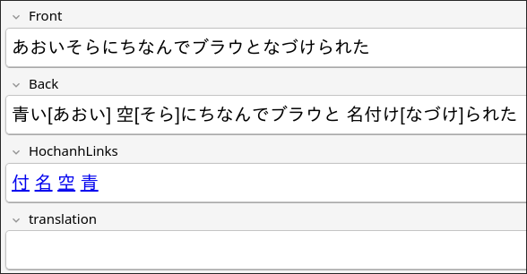
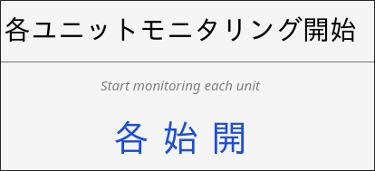
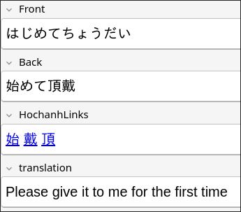

# ⛶ Japtoanki ⛶ 
<!-- 「日本語」➠ 「にほんご」  -->
**Automated pipeline to turn Japanese text from files or images into high-quality anki-flashcards**

Extracts sentences containing kanji from manga, screenshots, etc, with mokuro and automatically creates Anki flashcards for later study.

Uses Mokuro OCR to find text from images, and MeCab (Fugashi) to filter bad grammar and readings.

---

#### Features:

- Morphological analysis (MeCab / Fugashi) to discard OCR halucinations and junk.

- Generates standard *furigana* reading.

- Option to translate using Google translate API.

- Users can provide a .txt, .json, .md file containing kanji they have already mastered. Sentences containing only mastered kanji are filtered.

- Automatically links every unmastered kanji to the Hochanh RTK Guide.

- Pushes cards directly to Anki when Anki-connect is enabled, otherwise generates .csv decks to manually import into anki.

- Easy file navigation.

## Installation

```bash
pip install japtoanki
```

#### Requirements:

- [Python3.12](https://www.python.org/downloads/release/python-31212/)
- [Anki](https://apps.ankiweb.net/)
- [Mokuro OCR](https://github.com/kha-white/mokuro) (installed as depency)

## Usage

**Command Line Interface**

Running *japtoanki* opens a file navigator.

```bash
japtoanki
```

Highly recommended to use with [Anki-connect](https://github.com/amikey/anki-connect) plugin in Anki. Anki needs to be open as japtoanki runs.

```bash
japtoanki /path/to/directory --deck Kanji_Sentences --tag manga --no-furigana --translate en --mastered-kanji /path/to/file
```

run `activate-global-python-argcomplete --user` in the terminal so that flags autocomplete when TAB is pressed.

##### Flags:

`--deck` Name of the deck in Anki you would like to store the generated cards. If the deck doesn't exist, it will be created.

`--tags` Tag each generated card. By default every card is tagged "japtoanki"

`--translate` Translate each sentence into desired language using Google-translate API (Default is en (english))

`--no-furigana` Furigana is generated for kanji by default. Use this flag to disable.

`--mastered-kanji` Provide a document containing kanji you have already mastered to update the known set. Can be manually edited at (~/.mastered_kanji_list(japtoanki).txt)

---

### Note Model

Japtoanki creates a custom model in Anki with the following fields:


### Note Model
Japtoanki creates a custom Anki note type with the following fields:

  ~ **Front**: Japanese sentence with kanji (e.g.,きょうはいいてんきですね)

  ~ **Back**: Same sentence with furigana readings above kanji (e.g., 今日[きょう]はいい天気[てんき]ですね)

  ~ Use `--no-furigana` to show plain kanji

  ~ **HochanhLinks**: Clickable kanji links to RTK memorization guides (only shows unmastered kanji)

  ~ **Translation**: Optional automatic translation via Google Translate (`--translate en`)

## Examples

#### Cli file navigation


#### Anki cards:

  Front:



  Back:



Without any flags:

 
 



  When `--translate` and `--no-furigana` flags are used:




